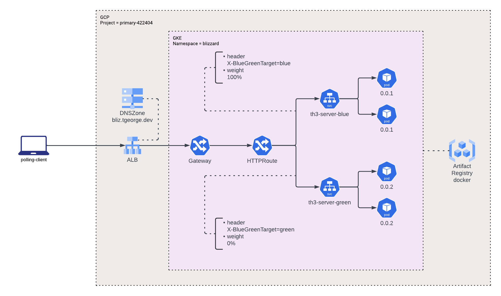

# Exercise Blue/Green Deployment
Exercise to build and validate blue green deployment across a Kubernetes Gateway implemented in GKE.

## Planning

### Requirements
* Build a deployment configuration for th3-server using a Blue/Green method
* Validate a new version (`0.0.2`) is deployed but not active for requests
* Transition traffic to the new version (`0.0.2`)
* Validate all new requests transition to the new version (`0.0.2`) without request loss
* Validate a new version (`0.0.1`) is still deployed but not active for requests
* Perform a roll back by transitioning back to the previous version (`0.0.1`)
* Validate all new requests transition to back to previous (`0.0.1`) version without request loss
* Transition new version (`0.0.2`) and decommission the previous version (`0.0.1`)
* Validate the previous version (`0.0.1`) is not longer active

### Design



The general plan is to host th3-server on a Kubernetes cluster in GKE. th3-server will be deployed into multiple different deployments each with their own: service, deployment, hpa, and healthcheck. All deployments are fronted by a single Application Load Balancer which routes the traffic to the appropriate service based on the active deployment or optionally on a request header.

A Helm Chart will be used to define all of the resources in the Kubernetes namespace. Included in the values files for this chart will be the list of deployments (blue, green, etc) and which deployment is currently active. Changes to this configuration will apply changes to the HTTPRoute resource which in turn will configure the Application Load Balancer to route traffic to the desired deployment service.

Example:
This will create 3 deployments, each with a different version. All requests which do not include a specific header will go to the `blue` deployment

```yaml
deployments:
  - id: blue
    tag: 0.0.1
  - id: green
    tag: 0.0.2
  - id: purple
    tag: 0.0.3

activeDeployment: blue
```

By changing the `deployments` and `activeDeployment` values and updating the helm release, deployments can be created and destroyed.

## Test - Blue Green Deployment

The configuration will start with one deployment on version `0.0.1`

```yaml
deployments:
  - id: blue
    tag: 0.0.1

activeDeployment: blue
```

A new deployment will be added with version `0.0.2`

```yaml
deployments:
  - id: blue
    tag: 0.0.1
  - id: green
    tag: 0.0.2

activeDeployment: blue
```

The active deployment will be changed to version `0.0.2`

```yaml
deployments:
  - id: blue
    tag: 0.0.1
  - id: green
    tag: 0.0.2

activeDeployment: green
```

The active deployment will rolled back to `0.0.1`

```yaml
deployments:
  - id: blue
    tag: 0.0.1
  - id: green
    tag: 0.0.2

activeDeployment: blue
```

A new version `0.0.3` will replace the green deployment

```yaml
deployments:
  - id: blue
    tag: 0.0.1
  - id: green
    tag: 0.0.3

activeDeployment: blue
```

The active deployment will be updated to `0.0.3`

```yaml
deployments:
  - id: blue
    tag: 0.0.1
  - id: green
    tag: 0.0.3

activeDeployment: green
```

The blue deployment version `0.0.1` will be destroyed

```yaml
deployments:
  - id: green
    tag: 0.0.3

activeDeployment: green
```

### Results

The test worked exactly as predicted, everything transitioned to each version while the active deployment was live and accepting requests the entire time. 

Looking at the test results you will see when `green` was transitioning from `0.0.2` to `0.0.3` there were errors for the `green_test`, this is because of a flaw in the selector labels which forced me to destroy and recreate the deployment rather than a direct rollout.\
You will also see errors in the `blue_test` when it is being decommissioned, this is caused because the ALB had not updated by the time the deployment was removed. This could be corrected by adding another parameter to allow the ALB to get an update before the deployment is removed, but that is not needed for this test.

The output of the primary test is [here](output.ndjson).

## Test - Blue Green Purple Deployment

As a second test which was allowed for in this design is to transition between 3 deployments.\
In this test case there was a `blue`, `green`, and `purple` deployment which corresponded to versions `0.0.1`, `0.0.2`, and `0.0.3` respectively. The traffic was transitioned from `blue -> green -> purple -> green -> blue`.

### Results

The second test transitioned as expected however when transitioning from `green -> blue` the final time the requests did go back and forth a couple of times before completing, which may warrant further investigation.

The output of the second test is [here](output.ndjson).

### Opportunities for Improvement (TODOs)
- [ ] The build (CI) of the image artifact is currently all manual and should be updated with a Cloud Build Job
  * The Cloud Build trigger would be setup on a git tag push and use that tag for the APP_VERSION
  * The Cloud Build trigger would be configured via Terraform
- [ ] The deployment (CD) of the containers is manged through a manual helm upgrade, this should be updated to use and ArgoCD app manifest
  * Pushes to the `main` brand of the values file would manage the deployment and traffic of the running service
- [ ] The helm chart should validate the activeDeployment is a valid deployment id
- [ ] The values for a startup probe were added, but the startup probe needs to be implemented in the template
- [ ] The polling-client could use some unit tests
- [ ] The polling-client could be improved with parallel HTTP requests
- [ ] The polling-client could output the results to a datastore for easier access and better analytics

## th3-server

### Build

Manually Build the artifact

```bash
export APP_VERSION=0.0.3 \
&& docker build -f Dockerfile.server -t us-west1-docker.pkg.dev/primary-422404/docker/th3-server:${APP_VERSION} --build-arg "APP_VERSION=${APP_VERSION}" .
```

Push Artifact to Registry

```bash
docker push us-west1-docker.pkg.dev/primary-422404/docker/th3-server:${APP_VERSION}
```

### Deploy

Manually deploy the helm chart

```bash
export NAMESPACE=blizzard
helm install th3-server-${GATEWAY_ID} . -n ${NAMESPACE}
```

Manually update the deployed helm config

```bash
export NAMESPACE=blizzard
helm upgrade th3-server-${GATEWAY_ID} . -n ${NAMESPACE}
```

## polling-client

### Run Polling Test

```bash
export APP_VERSION=latest \
&& docker compose build \
&& docker run localhost/polling-client:latest endpoints.tgeorge-dev.yaml
```

### Local Run (Development Testing)
This local test does not validate the Blue/Green deployment it only checks to make the the client is pulling the correct data from th3-server

```bash
export APP_VERSION=0.0.1 \
&& docker compose build \
&& docker compose up -d \
&& docker compose exec -it th3-server /bin/bash
```
